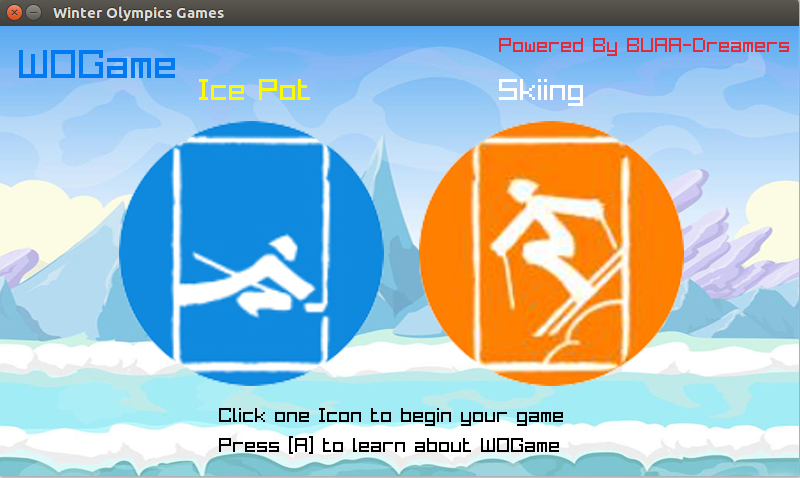
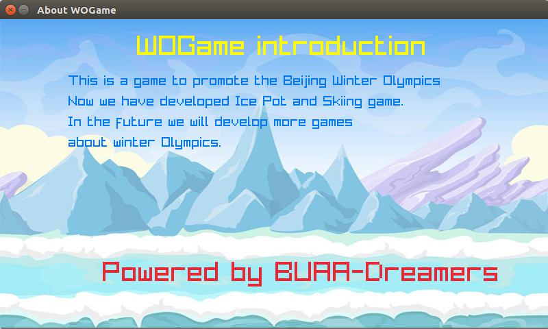
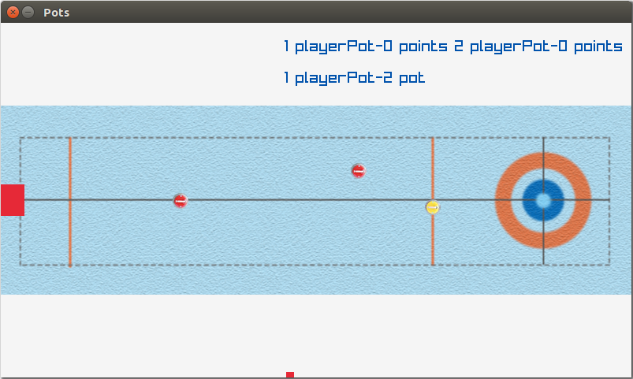
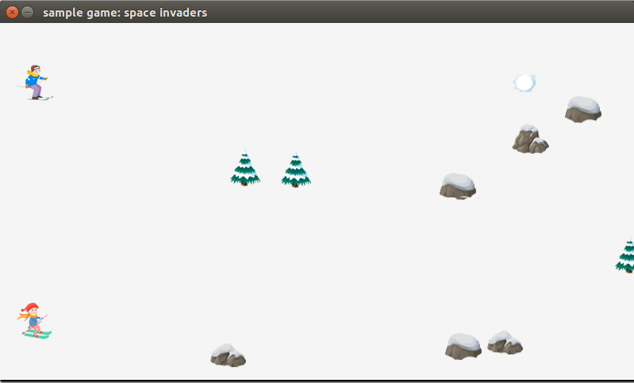

# WOGame

## Introduction

This is a Winter Olympic game APP base on [raylib](https://www.raylib.com/),containing two games,**Skiing** and **Ice Pot**.

This project is developed by 5 people team **Dreamers** from BUAA-SCSE in one day from 2021-5-8 to 2021-5-9 and take part in [HackPKU2021](https://www.hackpku.com/).

The team members:

- BUAADreamer
- Sharp1129
- 19373576
- BUAA19373333
- William-sulivan









## About code

Now you can only run this game on **Linux**.

We develop it on **Ubuntus**.

After clone,you should move the raylib directory to its parent src.

The files Tree like this:

```
root_src
-WOGame
-raylib
```

You can use shell code below to run.

```shell
home:~$ mv ./WOGame/raylib/ ./raylib/
home:~$ cd WOGame
home:~/WOGame$ make
home:~/WOGame$ ./game #execute the game
```


